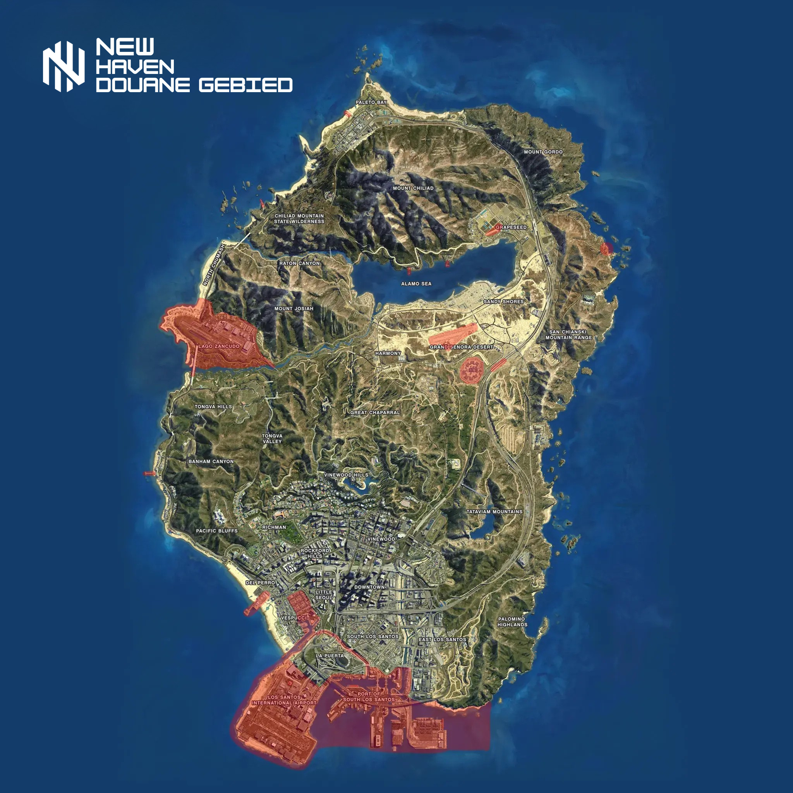

<article class="md-content__inner md-typeset">
                
                  

<h1 id="douanegebieden">Douanegebieden</h1>

In de volgende douanegebieden mag er preventief gefouillerd worden op personen, goederen en voertuigen door de Koninklijke Marechaussee en de Politie.

<h2 id="kaartweergave">Kaartweergave</h2>

                
              </article>